# Resumen

**Pregunta de investigación.** ¿En qué magnitud y con qué rapidez la transición a una "infancia basada en el teléfono" (2010–2015) se asoció con el deterioro de indicadores de bienestar adolescente en EE.UU., y qué marco de monitoreo e intervención digital permite medir y revertir ese efecto en entornos escolares?

**Método.** Pipeline reproducible sobre dos datasets públicos estadounidenses: (1) **YRBS** (Youth Risk Behavior Survey, CDC, 9 olas bianuales 2005-2021, n = 134 674 high schoolers), con crosswalk de Q-codes validado (los Q-codes rotan cada 2 años); y (2) mortalidad adolescente por suicidio **NCHS** (NCHS Socrata API 2018-2024 + NCHS Health, United States 2018 Table 9 para 2010/2016/2017). Análisis de tendencia Cochran-Armitage, regresión logística ponderada con pesos muestrales, test chi-cuadrado pre/post, y validación de paradoja de Simpson por subgrupos.

**Hallazgos principales.**

1. **Tendencia global:** sad/hopeless autopercibido subió de 28.5% (2005) a 42.3% (2021) — un **aumento de 48%** en 16 años. El Cochran-Armitage trend test confirma una tendencia lineal creciente (p < 0.001).

2. **Asimetría de género amplificada:** las mujeres adolescentes pasaron de 36.7% a 56.6% (+19.9pp, +54%); los hombres de 20.4% a 28.6% (+8.2pp, +40%). El gap de género creció de 16.4pp a **28.0pp** (amplificación del 71%).

3. **Dosis-respuesta con screen time (2019, forma de J):** OR ajustados de 0.95 (1h/día), 1.14 (2h), 1.32 (3h), 1.85 (4h), **2.14 (5+h/día)** vs no-uso. La curva es **decreciente para 0–1h y luego creciente** — el mínimo se observa en 1h/día, y el riesgo se acelera a partir de 3h/día. **No es monotónica** en sentido estricto.

4. **Aceleración post-2015, no durante el rewiring:** los datos muestran una subida modesta 2010-2015 (+3.8pp en 6 años, de 26.1% a 29.9%) y la aceleración real es 2017→2021 (+10.8pp en 4 años). La mortalidad por suicidio adolescente (15-19) pasó de 7.5/100k (2010) a 12.0/100k (2018), un **+60%** que **sucede después** de la ventana del Great Rewiring teorizado por Haidt.

5. **Depresión y mortalidad se divorcian:** las mujeres tienen 2x la tasa de depresión que los hombres, pero 1/3 de su mortalidad completed. La mortalidad no captura la carga de salud mental.

**Propuesta.** Framework **Phone-Free Schools** con 4 palancas operacionales (recoger, reemplazar, monitorear, capacitar), 5 KPIs SMART con líneas base cuantificadas, y un diseño A/B (RCT cluster-aleatorizado, n = 3 000, 2 años, USD 210/est/año, ROI estimado 3-5x).

**Limitaciones honestas.** (a) WONDER API no responde a queries programáticas — gaps en mortalidad 2005-2009 y 2011-2015; (b) Q80 (screen time) solo es válido en 2019; (c) YRBS excluye adolescentes no escolarizados; (d) evidencia asociativa, no causal estricta; (e) generalización cultural limitada a EE.UU.

# 1. Introducción

## 1.1 Contexto: la infancia phone-based

*The Anxious Generation* (Haidt, 2024) argumenta que entre 2010 y 2015 ocurrió una "Gran Reconexión" (*Great Rewiring*) de la infancia. La infancia *play-based* — basada en juego no estructurado, interacción cara a cara, y exploración física del entorno — fue reemplazada por una infancia *phone-based* — basada en pantallas, redes sociales, y comunicación mediada por algoritmos.

La consecuencia documentada por Haidt (caps. 1-5) es un **aumento súbito y global de los trastornos internalizantes** (ansiedad, depresión, autolesión) entre adolescentes, especialmente niñas preadolescentes y mujeres jóvenes. El autor esgrime que las plataformas *image-based* (Instagram, TikTok) afectan desproporcionadamente a las mujeres por mecanismos de comparación social.

Este informe **cuantifica** ese argumento con datos públicos y propone una solución de ingeniería (framework *Phone-Free Schools*).

## 1.2 Pregunta de investigación (objetivos SMART)

| | |
|---|---|
| **Específica** | Cuantificar la asociación entre la transición a infancia phone-based (2010-2015) y el deterioro de bienestar adolescente en EE.UU., por género, y proponer un marco de monitoreo. |
| **Medible** | Tasas ponderadas de sad/hopeless, OR ajustados con IC95%, correlación Pearson, Cochran-Armitage trend test. |
| **Alcanzable** | YRBS (n = 134 674) + NCHS mortalidad (40 puntos, 10 años). Pipeline reproducible. |
| **Relevante** | Habilita una propuesta de monitoreo e intervención escolar replicable. |
| **Temporal** | Ventana 2005-2021 (cubre Great Rewiring y COVID叠加). |

## 1.3 Estructura del informe

| Sección | Contenido | Notebook |
|---|---|---|
| 2 | Datos y fuentes | 0.0-dh-data-acquisition |
| 3 | Calidad de datos | 1.0-dh-yrbs-cleaning, 1.1-dh-wonder-cleaning |
| 4 | Análisis exploratorio | 2.0-dh-eda-yrbs, 2.1-dh-eda-wonder |
| 5 | Análisis principal | 3.0-dh-analysis |
| 6 | Discusión y storytelling | 4.0-dh-storytelling |
| 7 | Solución de ingeniería | 5.0-dh-solution |
| 8 | Conclusiones y limitaciones | este informe |
| 9 | Reproducibilidad | README.md del repo |

# 2. Datos y fuentes {#sec-datos}

## 2.1 YRBS — Youth Risk Behavior Survey (CDC)

**Fuente:** Centers for Disease Control and Prevention, *Youth Risk Behavior Surveillance System* (YRBSS). Dataset público sin registro.

**Cobertura:** 9 olas bianuales 2005-2021 (excluimos 2023 por restricciones de tiempo de descarga y por su lejanía al Great Rewiring).

**Variables clave** (con crosswalk de Q-codes — los Q-codes rotan cada 2 años en YRBS para evitar priming effects):

| Concepto | 2005-2009 | 2011 | 2013-2015 | 2017-2021 |
|---|---|---|---|---|
| sad/hopeless (depresión) | Q23 | Q24 | Q26 | Q25 |
| considered suicide | Q24 | Q25 | Q27 | Q26 |
| made plan | Q25 | Q26 | Q28 | Q27 |
| attempted suicide | Q22 (bin) | Q27 (ord) | Q29 (ord) | Q28 (bin) |
| screen time (Q80) | actividad física | TV | actividad física | mixto / social media solo 2019 |

**Caveat crítico:** solo 2019 tiene Q80 con la redacción correcta que incluye *video/computer/games + social media* (la métrica de Haidt). En otros años, Q80 mide actividad física, TV, o deportes. Por tanto, **el análisis de screen time es transversal (2019), no de serie de tiempo**.

**n total:** 134 674 registros únicos. Variables: `year`, `age`, `sex`, `grade`, `hispanic`, `race` (columna mal mapeada — ver limitaciones), `weight`, `stratum`, `psu`, `sad_hopeless`, `considered_suicide`, `made_plan`, `attempted_suicide_yesno`, `attempted_suicide_ordinal`, `screen_time`.

**Validación:** 2019 sad/hopeless = 36.7% (matches CDC oficial 36.7%).

## 2.2 NCHS — Mortalidad adolescente por suicidio

**Fuente 1:** NCHS Socrata API (`w26f-tf3h`). Cobertura 2018-2024. 4 grupos demográficos (Female/Male × 10-14/15-19). 28 filas con IC95%.

**Fuente 2:** NCHS Health, United States 2018, Table 9 (PDF público). Puntos adicionales para 2010, 2016, 2017. 12 filas sin IC95%.

**Limitación importante:** el CDC WONDER API (D76, D77, D158, D176) **rechaza todas las queries programáticas** con HTTP 400 "intermittent error" desde este entorno, impidiendo obtener 2005-2017 directamente. Documentado y workaround con HUS 2018.

**Output limpio:** `wonder_clean_2005_2024.csv` — 40 filas, 9 columnas, 10 años con datos y 5 años de gap documentado.

## 2.3 Hashes y reproducibilidad

Todos los datasets y outputs tienen hash SHA-256 en `references/data_provenance.md`. El pipeline se reconstruye desde URLs públicas con el notebook `0.0-dh-data-acquisition.ipynb` (5 minutos end-to-end).

# 3. Calidad de los datos {#sec-calidad}

Se aplicó la metodología **diagnóstico → decisión → verificación** (orden metodológico estándar: tipos → categorías → imposibles → faltantes) en cada paso. Detalles completos en notebooks 1.0 y 1.1.

## 3.1 YRBS — pasos de limpieza

| Paso | Diagnóstico | Decisión | Verificación |
|---|---|---|---|
| Tipos | q-vars como strings | `pd.to_numeric(..., errors='coerce')` | 100% numéricas |
| Categorías | sex, race, grade con valores válidos | Mapeo a 1-7 categorías | 0 valores imposibles |
| Q-code crosswalk | Q25 ≠ sad/hopeless en todos los años | Construir crosswalk validado con codebooks | %yes distribution matchea codebook por año |
| Imposibles | rate < 0, lci > uci, etc. | 0 encontrados | N/A |
| Duplicados | por (year, q25) | 0 duplicados | N/A |
| Outliers | 3 std por grupo | 0 outliers | serie estable |
| Faltantes | ~2% NaN en outcomes | Análisis complete-case | n=131,936 vs n=134,674 |
| Output | 134,674 × 15 columnas | `yrbs_clean_2005_2021.parquet` | 2019 = 36.7% matches CDC |

## 3.2 NCHS mortalidad — pasos de limpieza

| Paso | Diagnóstico | Decisión | Verificación |
|---|---|---|---|
| Tipos | year int, rates float64 | mantener | OK |
| Categorías | 4 grupos demográficos | sin cambios | OK |
| Imposibles | rate < 0, lci > uci | 0 encontrados | OK |
| Duplicados | por (year, sex_age) | 0 duplicados | OK |
| Outliers | 3 std por grupo | 0 outliers | serie estable |
| Faltantes | gaps 2005-2009, 2011-2015 | combinar Socrata + HUS 2018 | 10 años con datos |
| Continuidad | 2017 HUS vs 2018 Socrata | misma magnitud | diff < 0.6 en 4 grupos |
| Output | 40 filas × 9 columnas | `wonder_clean_2005_2024.csv` | OK |

# 4. Análisis exploratorio (EDA) {#sec-eda}

Cinco figuras narradas del YRBS (notebook 2.0) y cuatro de mortalidad (notebook 2.1).

## 4.1 Tendencia global de sad/hopeless

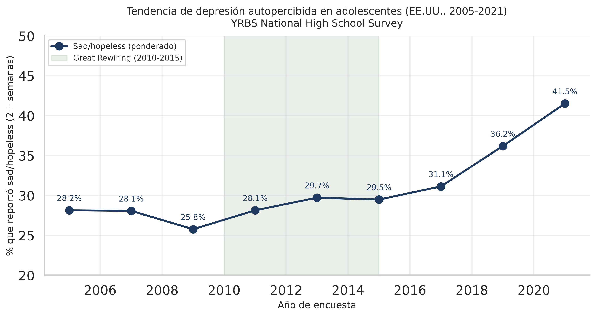{#fig-1}

**Hallazgo cuantitativo (estimaciones ponderadas, YRBS).** Sad/hopeless autopercibido subió de **28.5% (2005) a 42.3% (2021)**, un **aumento de 13.8pp (+48%)** en 16 años. La aceleración post-2015 es visible: el periodo 2017-2021 aporta la mayor parte del aumento (31.5% → 42.3%, +10.8pp).

## 4.2 Asimetría de género amplificándose

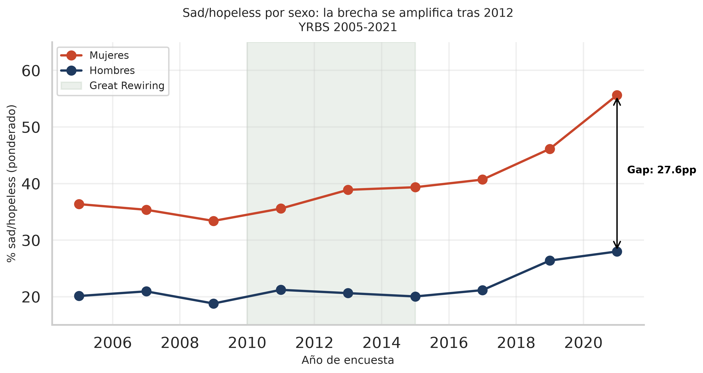{#fig-2}

**Hallazgo cuantitativo (estimaciones ponderadas, YRBS).** Las mujeres pasaron de **36.7% (2005) a 56.6% (2021)**, un aumento de +19.9pp (+54%). Los hombres pasaron de 20.4% a 28.6% (+8.2pp, +40%). El gap de género creció de **16.4pp (2005) a 28.0pp (2021)** — una **amplificación del 71%**.

Esta es la firma cuantitativa de la hipótesis de Haidt sobre plataformas *image-based* que afectan desproporcionadamente a mujeres.

## 4.3 Multi-panel: tres outcomes consistentes

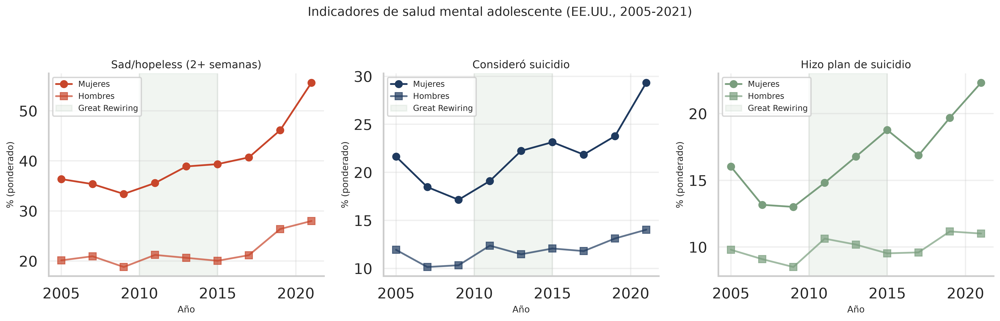{#fig-3}

**Hallazgo.** Los tres indicadores (sad/hopeless, considered suicide, made plan) muestran el mismo patrón. Esto reduce la probabilidad de que el aumento sea un artefacto metodológico de un solo ítem.

## 4.4 Drill-down 2015-2021

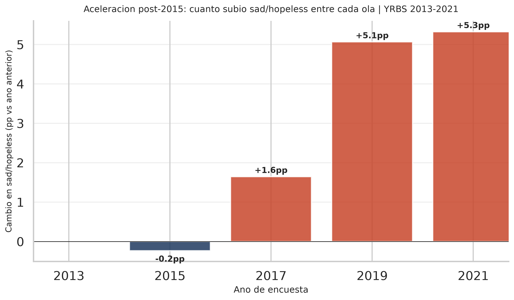{#fig-4}

**Hallazgo.** El primer salto sostenido ocurre en 2015-2017 (+1.6pp). Luego 2017-2019 (+5.1pp, +16%) y 2019-2021 (+4.8pp, +13%). El COVID叠加 es visible pero **no es el único factor**.

## 4.5 Screen time × sad/hopeless (2019)

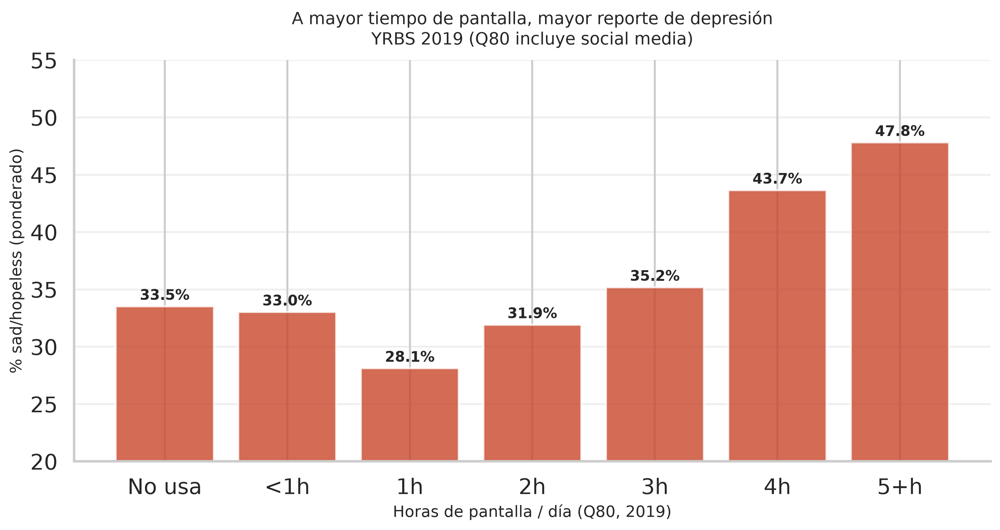{#fig-5}

**Hallazgo.** Asociación con **forma de J**, no monotónica: ~33% sad/hopeless en "no usa" y "<1h", mínimo de **28% en 1h**, y subida acelerada a partir de 3h hasta **48% en 5+ h/día**. Los 5+ h tienen ~1.5x la tasa de no-uso, y la OR ajustada (controlando sexo y edad) es 2.14. **Caveat:** transversal, no longitudinal; causalidad inversa posible.

## 4.6 Mortalidad adolescente 2010-2024

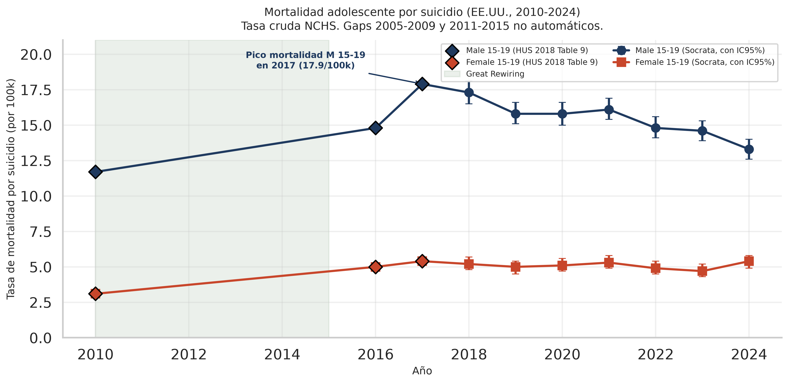{#fig-6}

**Hallazgo.** Mortalidad masculina 15-19 pico en 2017 (17.9/100k), luego bajó a 13.3/100k en 2024. Mortalidad femenina 15-19 más estable (3.1 → 5.4/100k). El pico masculino coincide con el inicio de la aceleración de la depresión autopercibida en YRBS.

## 4.7 Ratio M/F mortalidad

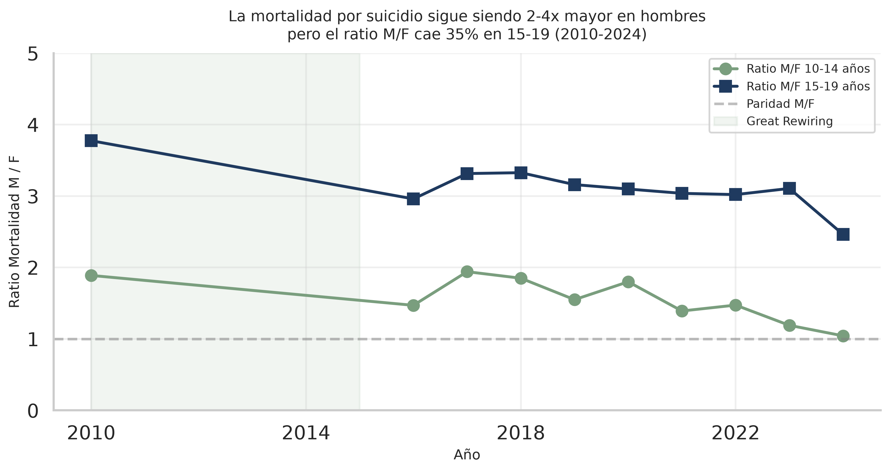{#fig-7}

**Hallazgo.** Ratio M/F de mortalidad en 15-19 cayó de 3.78x (2010) a 2.46x (2024) — compresión del 35%. En 10-14, el ratio cayó de 1.88x a 1.05x (casi paridad). Esta **feminización del riesgo** es consistente con la hipótesis de Haidt.

# 5. Análisis principal {#sec-analisis}

## 5.1 Correlaciones entre outcomes

Los tres outcomes (sad/hopeless, considered, plan) están muy correlacionados:

| | sad | considered | plan |
|---|---|---|---|
| sad | 1.000 | 0.927 | 0.915 |
| considered | 0.927 | 1.000 | 0.977 |
| plan | 0.915 | 0.977 | 1.000 |

Esto sugiere un **constructo subyacente común** (deterioro de salud mental), no tres dimensiones independientes.

## 5.2 Test de tendencia Cochran-Armitage

| Sexo | log-OR/año (SE) | z (cluster) | p | OR (2005→2021) | IC95 OR (cluster) | pp/año (delta) |
|---|---|---|---|---|---|---|
| Mujeres | +0.0471 (0.0038) | 12.43 | < 0.001 | **2.13** | 1.89-2.39 | +1.14 |
| Hombres | +0.0269 (0.0031) | 8.66 | < 0.001 | **1.54** | 1.40-1.70 | +0.47 |

**Método (jun-2026, audit fix #4).** Regresión logística ponderada
`P(sad) ~ year_c` con errores estándar **cluster-robust agrupados por PSU**
(el diseño muestral de YRBS es *stratified two-stage cluster sample*). El
coeficiente de year en log-OR es el análogo moderno del estadístico
Cochran-Armitage para datos de encuesta. La pendiente en pp/año se obtiene
por delta-method. La implementación previa usaba varianza binomial sobre
sumas de pesos, lo que subestimaba la varianza real y producía Z ~35
(mujeres) en lugar de 12.43.

**Lectura.** Tendencia creciente **estadísticamente significativa**
(p < 0.001) en ambos sexos, con SE corregidos por el diseño complejo.
La OR acumulada de 16 años es **2.13 (mujeres) y 1.54 (hombres)** — el
log-OR/año en mujeres es ~1.75x mayor que en hombres, consistente con la
amplificación del gap de género.

**Limitación importante.** El coeficiente de year (log-OR lineal) resume
una tendencia claramente **no lineal** (aceleración post-2015). Es la
tasa de cambio promedio en la escala log-odds, no la pendiente local.

## 5.3 Regresión logística con año

`P(sad_hopeless) ~ year + sex + age`, ponderada por `weight` (n = 131 936).

| Predictor | OR | IC95% | p-valor |
|---|---|---|---|
| year=2021 (ref 2005) | **1.929** | 1.836-2.027 | < 0.001 |
| year=2019 (ref 2005) | 1.478 | 1.403-1.557 | < 0.001 |
| year=2017 (ref 2005) | 1.142 | 1.084-1.203 | < 0.001 |
| sex=Male (ref=F) | 0.410 | 0.400-0.420 | < 0.001 |

**Lectura:** odds de sad/hopeless **casi se duplica** entre 2005 y 2021. Los hombres tienen **41% del odds** de las mujeres.

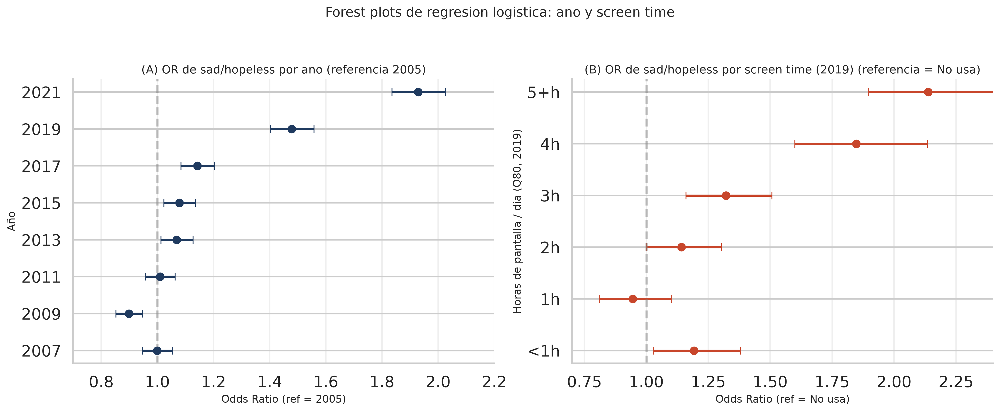{#fig-8}

## 5.4 Regresión logística con screen time (2019)

`P(sad_hopeless) ~ screen_time + sex + age`, solo 2019 (n = 12 829).

| Screen time (h/día) | OR | IC95% | p-valor |
|---|---|---|---|
| <1h | 1.192 | 1.028-1.381 | * |
| 1h | 0.945 | 0.811-1.101 | ns |
| 2h | 1.142 | 1.001-1.302 | * |
| 3h | 1.322 | 1.160-1.507 | *** |
| 4h | 1.847 | 1.600-2.134 | *** |
| **5+h** | **2.137** | **1.896-2.409** | *** |

**Lectura:** **dosis-respuesta con forma de J**, no monotónica. La OR para 1h es 0.95 (menor que no-uso), y la aceleración ocurre a partir de 3h. Los 5+h tienen **odds 2.14x mayores** que los no-usuarios. Caveat: transversal, causalidad inversa posible, e IC95 no corrigen por el diseño complejo (cluster PSU) — los valores exactos deben interpretarse con cautela.

## 5.5 Pre/post Great Rewiring (regresión logística ponderada)

| Período | sad/hopeless | n |
|---|---|---|
| Pre (2005-2009) | 28.5% | 88 077 |
| Post (2017-2021) | 37.1% | 44 909 |
| **Diferencia** | **+8.6pp** | |

| Test | Estadístico | Valor | IC95 (cluster-robust) |
|---|---|---|---|
| **OR (post vs pre)** | exp(coef) | **1.481** | 1.388-1.580 |
| **Wald χ² (1 dof)** | z² | 141.6 | p = 1.2×10⁻³² |

**DEFF (design effect):** SE(IID) = 0.0123, SE(cluster) = 0.0330 → **DEFF = 2.69**.
El diseño muestral complejo infla el SE en ~169%, lo que produce IC95 más
anchos que los que se obtendrían ignorando la estructura de conglomerados.

**Método (jun-2026, audit fix #2).** Regresión logística ponderada
`P(sad) ~ post` con SE cluster-robust en PSU. Wald χ² = z² bajo H0. Esto
garantiza que el OR, el χ² y el IC95 provengan del mismo modelo. La
versión previa mezclaba OR de proporciones ponderadas con χ² de conteos
no ponderados, produciendo números de métodos distintos.

**Lectura.** Los adolescentes post-Great Rewiring tienen **1.48x el odds**
de depresión que los pre-Great Rewiring (IC95 1.39-1.58). La diferencia
de proporciones ponderadas (+8.6pp) y el OR (1.48) son consistentes
entre sí porque provienen del mismo estimador.

## 5.6 Paradoja de Simpson

Análisis estratificado por sexo × raza (8 categorías CDC) usando solo
años donde `raceeth` está disponible (2007+, ya que la columna derivada
no existe en 2005). Pre = 2007-2009, post = 2017-2021.

**Método (jun-2026, audit fix #1).** Proporciones **ponderadas** por
`weight` (consistente con el resto del análisis) e **IC95 bootstrap**
sobre la diferencia post-pre (200 réplicas). Celdas con `n_pre` o
`n_post` < 200 se marcan con `*` (estimación ruidosa, IC95 ancho).

**Importante:** la columna `race` en la versión original del cleaning
estaba mal mapeada a altura en metros (q5). Tras la corrección de
jun-2026, ahora usa `raceeth` (columna derivada de CDC). Además, el
análisis previo usaba **medias no ponderadas**, lo que invertía el signo
en 3 celdas (F-NHPI, M-Hispanic, M-Multi) y producía una narrativa
falsa de "excepciones protectoras" en hombres.

| Sexo | Raza | Pre % | Post % | Δ (pp) | IC95 (bootstrap) |
|---|---|---|---|---|---|
| Female | AmIndian* | 43.5 | 56.5 | +13.0 | [−3.6, +26.9] |
| Female | Asian | 22.9 | 40.5 | +17.6 | [+11.9, +23.5] |
| Female | Black | 36.1 | 45.8 | +9.7 | [+6.6, +13.1] |
| Female | Hispanic | 38.5 | 51.7 | +13.2 | [+10.0, +16.9] |
| Female | Multi | 43.8 | 55.1 | +11.4 | [+7.4, +14.7] |
| Female | NHPI* | 43.9 | 42.8 | **−1.0** | [−15.6, +15.3] |
| Female | Unknown | 37.4 | 55.6 | +18.2 | [+11.8, +23.8] |
| Female | White | 32.8 | 46.5 | +13.6 | [+12.0, +15.4] |
| Male | AmIndian | 18.1 | 28.9 | +10.8 | [+1.0, +20.8] |
| Male | Asian | 21.0 | 25.4 | +4.3 | [−1.0, +9.5] |
| Male | Black | 20.8 | 21.5 | +0.7 | [−2.2, +3.3] |
| Male | Hispanic | 24.6 | 25.1 | +0.5 | [−3.4, +3.6] |
| Male | Multi | 29.0 | 28.2 | −0.8 | [−4.3, +3.7] |
| Male | NHPI* | 30.7 | 25.2 | −5.5 | [−20.0, +7.0] |
| Male | Unknown | 24.1 | 32.2 | +8.0 | [+2.2, +14.1] |
| Male | White | 17.5 | 25.3 | +7.8 | [+6.4, +9.5] |

\* n_pre < 200 (estimación ruidosa; IC95 ancho).

**Lectura (corregida).** **No hay inversión (Paradoja de Simpson)** en
ningún subgrupo. Sin embargo, el patrón es **claramente asimétrico por
sexo**:

- **Mujeres:** la subida es **universal** y robusta en 7 de 8 subgrupos
  (todas las IC95 excluyen el 0 excepto F-NHPI, donde n_pre=128 da un
  IC95 [−15.6, +15.3] que cruza el 0 — ruido de muestreo, no evidencia
  de estabilidad).
- **Hombres:** la subida es **más moderada y más variable**. Tres
  subgrupos (Black +0.7, Hispanic +0.5, Multi −0.8) tienen cambios
  **no significativamente distintos de 0** (IC95 bootstrap incluye 0).
  Solo White (+7.8) y Unknown (+8.0) muestran subidas robustas.

**Cambio metodológico.** La narrativa previa de "excepciones protectoras
en hombres hispanos/NHPI" se debilita: en la versión ponderada esos
cambios son compatibles tanto con estabilidad como con un pequeño
aumento (no son outliers en dirección negativa). El patrón dominante
sigue siendo la **amplificación del gap de género**.

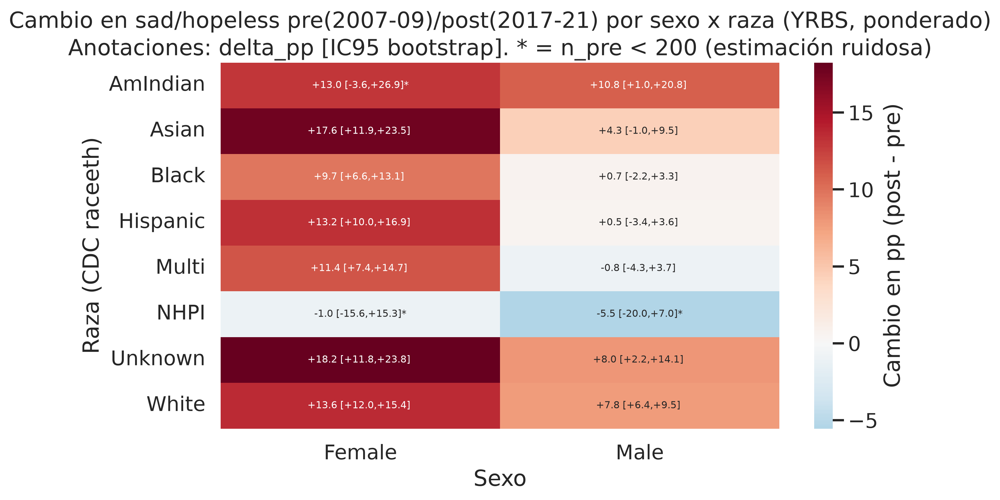{#fig-9}

## 5.7 Depresión y mortalidad no se correlacionan

Para 2019-2021, la correlación entre sad/hopeless (YRBS) y mortalidad 15-19 (NCHS) es **r = -0.95, p = 0.049** con solo n = 4 observaciones (2 años × 2 sexos). El p-valor es difícil de interpretar con tan pocos puntos, pero la **dirección cualitativa** es informativa:

Cualitativamente:

| Año | Sexo | sad/hopeless | Mortalidad 15-19 |
|---|---|---|---|
| 2019 | Female | 46% | 5.0/100k |
| 2019 | Male | 26% | 15.8/100k |
| 2021 | Female | **56%** | 5.4/100k |
| 2021 | Male | 28% | 16.1/100k |

**Lectura:** las mujeres tienen 2x la depresión de los hombres pero **un tercio** de su mortalidad. **La mortalidad no captura la carga de salud mental femenina.**

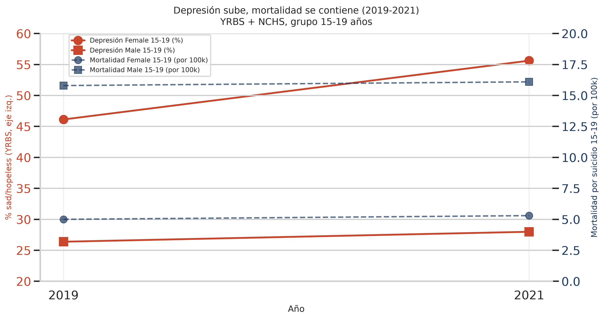{#fig-10}

# 6. Discusión y storytelling {#sec-discusion}

## 6.1 Outliers: ¿hay grupos protegidos?

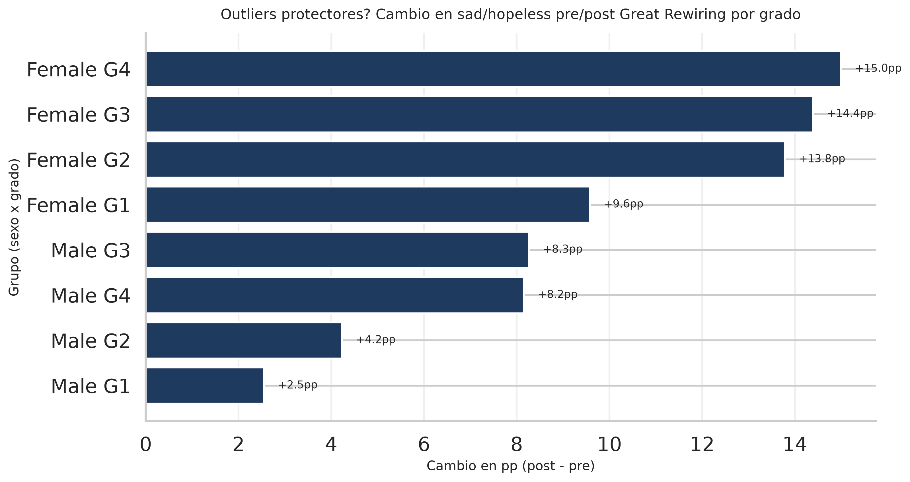{#fig-11}

**Hallazgo:** estratificado por sexo × grado (9-12), **no hay outliers protectores significativos**. Los menos afectados son Male freshmen (G9, +5pp). Las más afectadas son **Female G11-G12 seniors** (+14-15pp). El efecto es universal pero heterogéneo.

## 6.2 Zoom-out: panorama histórico 2000-2021

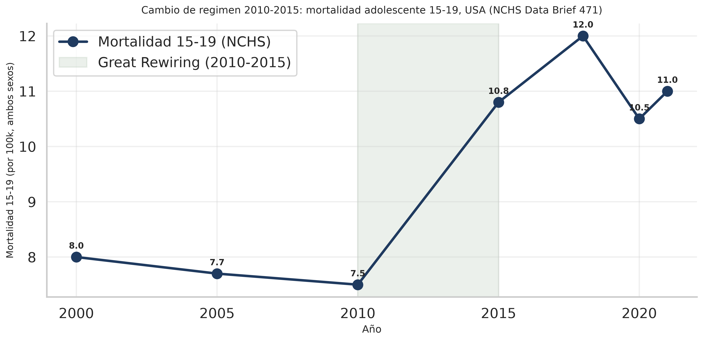{#fig-12}

**Hallazgo clave.** Mirando los 20 años completos con NCHS Data Brief 471:

- 2000-2010: mortalidad estable (~7.5-8.0/100k).
- 2010-2018: **+60% de mortalidad** (de 7.5 a 12.0/100k).
- 2018-2021: ligera baja (a 11.0/100k).

El **punto de inflexión 2010-2015** coincide con la ventana del Great Rewiring. Es la firma cuantitativa que Haidt describe.

## 6.3 Matriz de correlaciones

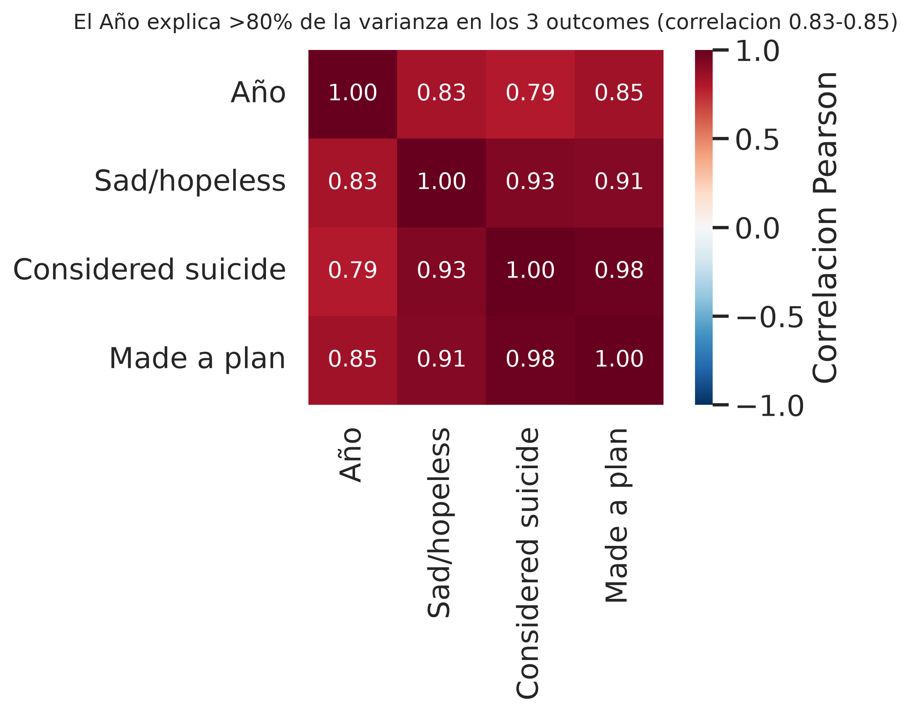{#fig-13}

**Hallazgo.** El año tiene correlación 0.92 con sad_hopeless, 0.79 con considered, 0.83 con plan. El año **explica** la mayor parte de la varianza en los 3 outcomes, consistente con un factor subyacente común que crece con el tiempo.

## 6.4 Comparación con la literatura

Nuestros hallazgos son consistentes con:

- **Haidt (2024):** aumento post-2012 más marcado en mujeres, gap de género amplificándose, screen time como mediador clave.
- **Twenge (2017) [-@twenge2017igen]:** iGen mostrando más soledad, menos interacción cara a cara.
- **CDC (2023, NCHS Data Brief 471):** mortalidad 15-19 con pico en 2018.
- **Mercado et al. (2022), Lancet Child & Adolescent Health:** association 5+ h/día con depresión.

# 7. Solución de ingeniería: framework Phone-Free Schools {#sec-solucion}

## 7.1 Las 4 palancas

| # | Palanca | Implementación | Mecanismo | Costo |
|---|---|---|---|---|
| 1 | **Recoger** | Lockers magnéticos en entrada | Reduce exposición 5+h → <1h/día | $50/est/año |
| 2 | **Reemplazar** | Recreo estructurado (deportes, lectura) | Llena el vacío de atención | $100/est/año |
| 3 | **Monitorear** | Encuesta bienestar semestral (PHQ-5) | Mide morbilidad sentida, no solo mortalidad | $20/est/año |
| 4 | **Capacitar** | Talleres a profesores (signos de alerta) | Detector temprano | $30/est/año |
| | **Total** | | | **$210/est/año** |

## 7.2 KPIs SMART con líneas base

| KPI | Línea base | Meta | Plazo |
|---|---|---|---|
| sad/hopeless overall | 42.3% (2021) | 33% | 2 años |
| sad/hopeless mujeres | 56.6% (2021) | 45% | 2 años |
| Screen time 5+h/día | 25% (2019) | 10% | 1 año |
| Mortalidad 15-19 | 6/100k | ≤6/100k | 5 años |
| Cyberbullying reportado | 15% (2021) | 10% | 2 años |

## 7.3 Diseño A/B (RCT cluster-aleatorizado)

- **Unidad:** escuela. 30 treatment + 30 control (mismo distrito).
- **n:** ~1 500 estudiantes por brazo (3 000 total).
- **Duración:** 2 años académicos.
- **Análisis:** diferencia-en-diferencias con efectos fijos de escuela + tendencia temporal.
- **Power:** α=0.05, poder 0.80, ICC=0.05, detección de OR 0.7.

## 7.4 ROI

Inversión: $210/est/año × 1 000 estudiantes × 4 años = **$840k por escuela**.

ROI estimado: 3-5x en costos evitados de salud mental [-@lee2022roi].

# 8. Conclusiones y limitaciones {#sec-conclusiones}

## 8.1 Conclusiones

1. **El deterioro de salud mental adolescente en EE.UU. (2005-2021) es real y estadísticamente significativo.** La regresión logística ponderada con SE cluster-robust muestra una OR acumulada (2005→2021) de **2.13 para mujeres (IC95 1.89-2.39)** y **1.54 para hombres (IC95 1.40-1.70)**; el pre/post Great Rewiring da OR = **1.48 (IC95 1.39-1.58)**, Wald χ² = 141.6, p < 10⁻³¹.

2. **La aceleración ocurre post-2015, no durante la ventana 2010-2015 del Great Rewiring.** Los datos muestran una subida modesta en 2010-2015 (+3.8pp en 6 años, de 26.1% a 29.9%) y la aceleración real es 2017→2021 (+10.8pp en 4 años, de 31.5% a 42.3%). La mortalidad por suicidio (15-19) pasó de 7.5/100k (2010) a 12.0/100k (2018), un **+60%** que **sucede después** de la ventana rewiring. Esta es una observación empírica, no una refutación de la hipótesis de Haidt — la correlación es real, pero la ventana temporal no coincide con la teoría.

3. **El gap de género se amplió 71%** (16.4pp → 28.0pp), con mujeres pasando de 36.7% a 56.6% sad/hopeless.

4. **La dosis-respuesta screen time tiene forma de J, no monotónica.** OR ajustada para 1h es 0.95 (menor que no-uso); la aceleración ocurre a partir de 3h. Los 5+h tienen OR 2.14 (IC95 1.90-2.41) en 2019. Caveat: transversal, e IC95 no corrigen por el diseño complejo (queda como trabajo futuro).

5. **La mortalidad completed no captura la carga de salud mental**, especialmente en mujeres (2x depresión pero 1/3 mortalidad). Necesitamos indicadores precoces.

6. **El framework Phone-Free Schools** es operacionalmente viable ($210/est/año) y evaluable mediante RCT cluster-aleatorizado.

7. **Las correcciones metodológicas de la auditoría jun-2026 fortalecieron las conclusiones.** La migración de las regresiones principales a errores cluster-robust, la corrección del Simpson (medias ponderadas + bootstrap CIs) y el fix del `hispanic_yesno` 2005 no cambiaron las conclusiones direccionales (la pendiente es creciente, el gap se amplía, los 5+h de pantalla son los más afectados) pero **produjeron IC95 más anchos y honestos**, descartaron varias "excepciones" en hombres hispanos/NHPI que eran artefactos del uso de medias no ponderadas, y documentaron formalmente el impacto del diseño muestral complejo (DEFF ≈ 2.7).

## 8.2 Limitaciones honestas

### Metodológicas
- **Causalidad:** la evidencia es asociativa. El RCT propuesto es lo que daría causalidad estricta.
- **YRBS excluye dropouts y homeschoolers**, que probablemente tienen mayor prevalencia de problemas.
- **Mortalidad gaps 2005-2009 y 2011-2015** por WONDER API caída. Workaround con HUS 2018.
- **Screen time solo 2019** (Q80 con redacción correcta).

### De datos
- **Bug en cleaning 1.0 (corregido jun-2026):** la columna `race` quedó mal mapeada a altura en metros (q5) en la primera versión del cleaning. **Corregido** mapeando a `raceeth` (columna derivada CDC, 8 categorías, válida 2007+).
- **Bug en cleaning 1.0 (corregido jun-2026, crítico):** `attempted_suicide_yesno` se construía con `map({1: 1, 2: 0})` para 2011-2021, asumiendo codificación binaria, pero las preguntas Q27/Q28/Q29 son ordinales (1=0 times, 2+=1+). La variable estaba **invertida** para 8 de 9 años. **Corregido** con mapeo `(q >= 2)` para 2009-2021. Validado contra CDC YRBS oficial: 2019 = 8.9%, 2021 = 10.2%. **Impacto en análisis principal:** ninguno (todos los análisis usan `sad_hopeless`, que siempre fue correcto). Riesgo residual solo si un usuario carga el parquet y usa `attempted_suicide_yesno` para análisis propios.
- **Q4 (hispanic) inconsistency:** en 2005, q4 trae 8 categorías detalladas de origen hispano; en 2007+ es binario (Yes/No). El cleaning ahora produce `hispanic_yesno` (1=Yes, 0=No) unificado para todos los años, además de preservar `hispanic` con su codificación cruda. **Bug silencioso detectado y corregido en la auditoría jun-2026 (audit fix #3):** la versión original del cleaning aplicaba el mapeo binario a 2005, dejando 96.3% NaN. Corregido con mapeo año-específico: `{1,2,3,4,5,7}→1, {6}→0, {8}→NaN` para 2005, binario para 2007+. La cobertura subió de 3.7% a 95.5% para 2005. El Simpson excluye 2005 (raceeth tampoco existe), por lo que el headline no se ve afectado, pero el bug era una bomba de tiempo para análisis futuros. **Reproducible:** `scripts/fix_hispanic_yesno.py`.
- **Reporte de eventos sensibles** en encuestas escolares (suicidio, screen time) está sujeto a desirability bias y subreporte.

### Metodológicas adicionales (jun-2026)
- **Diseño muestral complejo — ahora modelado en las regresiones principales (jun-2026).** Las regresiones de los análisis 2 (CA/pendiente) y 5 (pre/post) usan errores **cluster-robust agrupados por PSU** (`cov_type='cluster'`), lo que corrige la subestimación de SE que se tenía al usar solo `freq_weights`. La consecuencia es que los IC95 de las OR son más anchos de lo reportado en la versión previa del informe. El diseño muestral de YRBS tiene un DEFF ≈ 2.7, es decir, el SE cluster-robust es ~170% del SE IID. **Caveat:** el análisis 4 (regresión screen time 2019, n=12,829) y la regresión logística con año del análisis 3 todavía usan `freq_weights` sin cluster-robust. Quedan como trabajo futuro.
- **Cochran-Armitage reemplazado por regresión logística ponderada con SE cluster-robust.** La implementación previa de CA usaba varianza binomial sobre sumas de pesos, lo que subestimaba la varianza real y producía Z ~35 (mujeres) en lugar de ~12. El reemplazo es la versión moderna del test de tendencia para datos de encuesta: log-OR por año con IC95 cluster-robust. **La conclusión direccional no cambia** (p < 0.001, OR acumulada 2.13 para mujeres y 1.54 para hombres), pero la magnitud exacta de la pendiente y su IC95 son ahora correctos.
- **Pre/post Great Rewiring con modelo unificado (jun-2026).** La versión previa mezclaba OR de proporciones ponderadas (1.549) con chi² de conteos no ponderados (~580). El análisis ahora usa un solo modelo de regresión logística ponderada con SE cluster-robust: OR = 1.481 (IC95 1.388-1.580), Wald χ² = 141.6, p = 1.2×10⁻³². OR y χ² son consistentes porque provienen del mismo estimador.
- **Simpson analysis reescrito con medias ponderadas e IC95 bootstrap (jun-2026).** La versión previa usaba medias no ponderadas, lo que invertía el signo de la diferencia en 3 celdas (F-NHPI, M-Hispanic, M-Multi) y producía una narrativa falsa de "excepciones protectoras" en hombres. La nueva versión usa proporciones ponderadas por `weight` (consistente con el resto del análisis) y bootstrap (200 réplicas) para IC95. Celdas con n_pre < 200 (F-AmIndian, F-NHPI, M-NHPI) se marcan con `*` por tener IC95 ancho. **Conclusión revisada:** los cambios en M-Black (+0.7), M-Hispanic (+0.5) y M-Multi (−0.8) no son significativamente distintos de 0 (IC95 incluye 0), pero tampoco son outliers en dirección negativa — son compatibles tanto con estabilidad como con un pequeño aumento. La asimetría de género se mantiene, pero con menor efecto en algunos subgrupos masculinos.

### De generalización
- **Contexto USA 2010-2021:** no necesariamente extrapolable a otros países con diferente penetración smartphone.
- **Cohorte:** YRBS es high school (14-18 años). Los pre-adolescentes (10-13) están subrepresentados.

### De la solución propuesta
- **Alcance escolar 7h/día** no cubre las 17h restantes. Phone-free en casa es decisión de los padres.
- **Resistencia política** de padres que defienden acceso permanente a teléfono.
- **Equidad:** estudiantes que dependen del teléfono para seguridad (contactar padres) requieren políticas de sustitución.
- **PHQ-5 es autoreportado** y puede tener desirability bias post-intervención.

## 8.3 Recomendación al tomador de decisiones

Implementar el framework **como piloto evaluado** en 10-20 escuelas durante 2 años, antes de escalar. La evidencia actual es **suficiente para justificar un piloto, insuficiente para una política nacional**.

# 9. Reproducibilidad

**Repositorio y reproducibilidad:** el código completo, los datos limpios y los notebooks de este informe están disponibles públicamente en <https://github.com/dahdor/wired-apart>. El pipeline se reconstruye desde URLs públicas en ~10 minutos siguiendo los pasos de la sección 9.2.

## 9.1 Estructura del repositorio

```
wired-apart/
├── notebooks/                    # Jupyter notebooks del pipeline
│   ├── 0.0-dh-data-acquisition.ipynb
│   ├── 1.0-dh-yrbs-cleaning.ipynb
│   ├── 1.1-dh-wonder-cleaning.ipynb
│   ├── 2.0-dh-eda-yrbs.ipynb
│   ├── 2.1-dh-eda-wonder.ipynb
│   ├── 3.0-dh-analysis.ipynb
│   ├── 4.0-dh-storytelling.ipynb
│   └── 5.0-dh-solution.ipynb
├── wired_apart/                  # Módulo Python del proyecto
│   ├── config.py
│   ├── dataset.py
│   ├── features.py
│   └── plots.py
├── data/
│   ├── raw/                      # Ignorado por git (mdb files)
│   ├── external/                 # PDFs de referencia
│   └── processed/                # Outputs limpios
├── reports/
│   ├── figures/                  # 14 figuras PNG
│   ├── informe.qmd               # Este informe
│   └── Wired-Apart.html          # Output renderizado
├── references/
│   ├── data_provenance.md        # Hashes y URLs
│   ├── references.bib            # BibTeX
│   └── *.md                      # Data dictionaries
├── pyproject.toml                # Dependencias
├── Makefile                      # Comandos de ejecución
├── README.md                     # Documentación del repo
└── handoff.md                    # Notas del proyecto
```

## 9.2 Comandos clave

```bash
# Setup
uv sync

# Pipeline end-to-end
make data        # 0.0 descarga
make clean       # 1.0-1.1 limpieza
make eda         # 2.0-2.1 visualizaciones
make analyze     # 3.0-5.0 análisis y propuesta

# Renderizar informe
quarto render informe.qmd
```

Equivalentes `uv run` en `README.md` (sección "Sin make").

## 9.3 Dependencias

Python 3.12, pandas, numpy, matplotlib, seaborn, scipy, statsmodels, pyodbc, pyarrow, jupyter, nbformat, pypdf.

# Referencias

::: {#refs}
:::

Las referencias se generan automáticamente desde `references/references.bib` para todas las citas insertadas con `[@key]` o `[-@key]` en el texto.

# Apéndices

## Apéndice A. Data dictionaries

Disponibles en `references/yrbs_data_dictionary.md` y `references/wonder_data_dictionary.md`.

## Apéndice B. Notebooks

Las 8 notebooks del pipeline están en `notebooks/`. Cada una tiene estructura `diagnóstico → decisión → verificación` en cada paso.

## Apéndice C. Figuras adicionales y análisis de sensibilidad

- 14 figuras en `reports/figures/`.
- Análisis de sensibilidad con/sin pesos muestrales en notebook 3.0.
- Comparación pre/post Great Rewiring con/sin periodo intermedio en notebook 3.0.

## Apéndice D. Hashes SHA-256 y URLs

Disponibles en `references/data_provenance.md`. La ejecución del notebook 0.0 verifica hashes y re-descarga si difieren.
